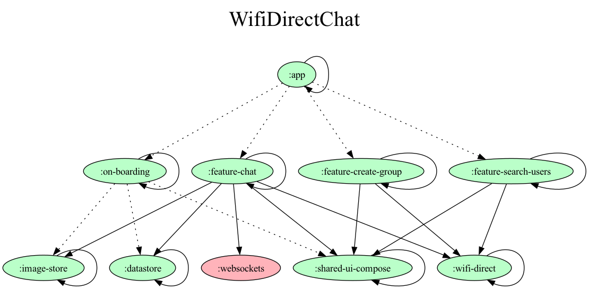

# wd-chat

## Generated Dependency Graph

## Features
- Uses WiFi Direct to create a P2p connection between devices.
- Runs a ktor server on the group owner of the wifi P2p group and acts as the backend for the chat.
- Uses Websockets to transmit messages and images betweens multiple devices.
- All images are stored locally and will be deleted after if not saved.
- Allows keyboard image support and Sticker support. 

## Tech Stack 
[Dagger Hilt](https://dagger.dev/hilt/)
[Ktor server + Ktor Client](https://ktor.io/)
[Lottie Compose](https://github.com/airbnb/lottie/blob/master/android-compose.md)
[Coil](https://coil-kt.github.io/coil/compose/)
[Jetpack Datastore](https://developer.android.com/jetpack/androidx/releases/datastore)
[KotlinxSerialization](https://kotlinlang.org/docs/serialization.html)
[Coroutines + Flow](https://kotlinlang.org/docs/coroutines-overview.html)

## Project Architecture
The App uses MVVM architecture and exposes the data to the jetpack comopse UI using kotlin Flow.
Every viewmodel also has a way of passing effects down to the Compose Ui elements from the EventViewmodel that utalizes Channels.

### Modules
The app is divided into seperate feature modules as show in the dependency graph above. 
The modules that are not labled feature are common utilities that are shared between the different feature modules.

### Featrue Structure
Each feature module contains a compose-ui screen that uses the jetpack viewmodel to hold its state. The viewmodels used extend EventViewmodel which provides a channel that can be used to emit sideeffects to the ui such as showing snackbars. Each viewmodel is responsible for making calls to the business logic through usecases provided to it. The use cases are devided into a functional interface and a function defining its implementation. This allows for a nice interop with dagger hilt to provide the use cases to the viewmodel. 

## Gradle / Dependencies 
Some of the common dependencies are shared between the modules using a TOML file to provide the versions and dependeny.
A gradle task is also defenied to generate a new dependency graph and turn the dot file into a png that can be displayed. 

## App Images 

